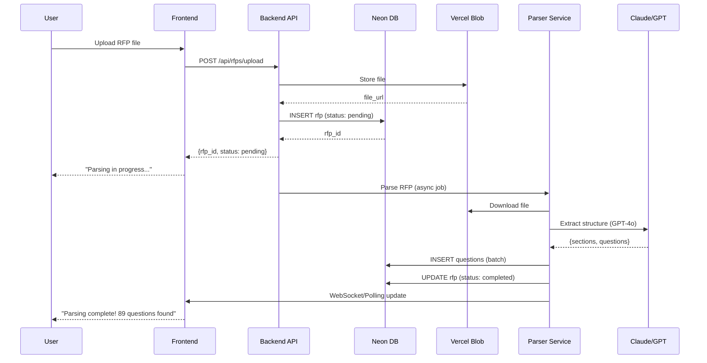
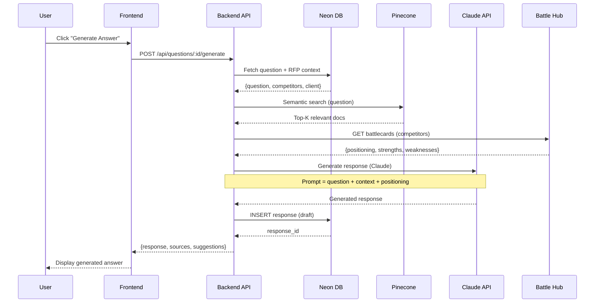
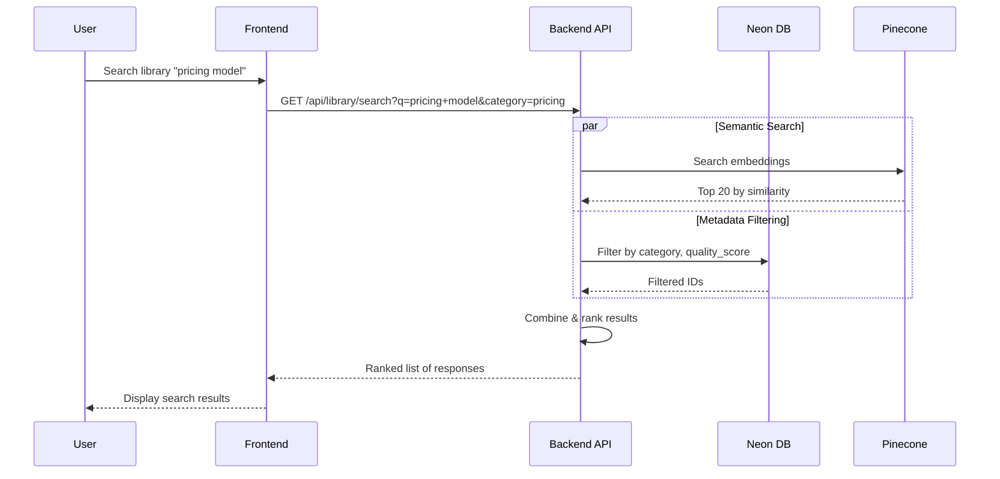

# Architecture Technique - Module RFP Response Assistant

**Version:** 1.0
**Date:** 2025-11-10

---

## Table des Matières

1. [Vue d'ensemble](#1-vue-densemble)
2. [Stack technique](#2-stack-technique)
3. [Architecture des composants](#3-architecture-des-composants)
4. [Flux de données](#4-flux-de-données)
5. [Services et microservices](#5-services-et-microservices)
6. [Déploiement](#6-déploiement)
7. [Scalabilité et performance](#7-scalabilité-et-performance)
8. [Sécurité](#8-sécurité)

---

## 1. Vue d'ensemble

### 1.1 Principes architecturaux

- **Serverless-first** : Utilisation de services managés pour réduire la complexité opérationnelle
- **API-driven** : Architecture RESTful avec possibilité future de GraphQL
- **Event-driven** : Événements asynchrones pour les tâches longues (parsing, AI generation)
- **Modulaire** : Séparation claire entre parsing, génération, storage, et UI

### 1.2 Contraintes

- **Temps de réponse** : Génération de réponse <10s par question
- **Scalabilité** : Support de 100+ RFPs actifs simultanément
- **Disponibilité** : 99.9% uptime (pas critique mission, mais business-important)
- **Coût** : Optimiser coûts LLM via caching et batch processing

---

## 2. Stack technique

### 2.1 Frontend

```
Framework: Next.js 14+ (App Router)
├── React 18+
├── TypeScript
├── Styling: Tailwind CSS + shadcn/ui
├── State Management: Zustand ou React Context
├── Forms: React Hook Form + Zod validation
├── Rich Text Editor: Tiptap ou Lexical
└── Charts: Recharts ou Chart.js
```

**Choix rationale :**
- Next.js : SSR, excellent DX, déploiement facile sur Vercel
- shadcn/ui : Components modernes, customisables, accessible
- Tiptap : Rich text editor flexible pour réponses formatées

### 2.2 Backend

```
Runtime: Node.js 20+ (TypeScript)
├── Framework: Next.js API Routes ou Express.js
├── API: REST (avec validation Zod)
├── Auth: NextAuth.js ou Clerk
├── File Upload: UploadThing ou Vercel Blob
└── Background Jobs: Inngest ou BullMQ
```

**Alternative Python (si préférence) :**
```
Framework: FastAPI
├── Python 3.11+
├── Async/await support
├── Background Tasks: Celery + Redis
└── File Processing: PyMuPDF, python-docx
```

### 2.3 Données

```
Primary Database: Neon PostgreSQL
├── ORM: Drizzle ou Prisma (TypeScript)
├── Migrations: Drizzle Kit ou Prisma Migrate
└── Connection Pooling: Neon serverless (natif)

Vector Database: Pinecone
├── Embeddings: OpenAI text-embedding-3-large
├── Index: question-library (1536 dimensions)
└── Metadata filtering: category, industry, tags
```

### 2.4 IA/ML

```
LLMs:
├── Primary: Claude Sonnet 4.5 (Anthropic)
│   └── Use: Response generation, analysis
├── Secondary: GPT-4o (OpenAI)
│   └── Use: Structured extraction (JSON mode)
└── Tertiary: GPT-4o Mini
    └── Use: Quick tasks, categorization

Embeddings: OpenAI text-embedding-3-large
└── Use: Semantic search dans library

Document Processing:
├── PDF: PyMuPDF (Python) ou pdf-parse (Node)
├── DOCX: python-docx ou mammoth.js
├── XLSX: openpyxl ou xlsx (Node)
└── OCR: Tesseract (si PDF scannés)
```

### 2.5 Infrastructure

```
Hosting: Vercel (Frontend + API)
├── Edge Functions pour endpoints rapides
├── Serverless Functions pour AI processing
└── CDN intégré

File Storage: Vercel Blob ou Cloudflare R2
├── Original RFP files
└── Exported documents

Background Jobs: Inngest ou Trigger.dev
├── RFP parsing (async)
├── Batch AI generation
└── Analytics aggregation

Monitoring:
├── Vercel Analytics
├── Sentry (error tracking)
└── PostHog (product analytics)
```

---

## 3. Architecture des composants

### 3.1 Diagramme global

```
┌───────────────────────────────────────────────────────────────┐
│                         FRONTEND (Next.js)                     │
│  ┌──────────────┐  ┌──────────────┐  ┌──────────────┐        │
│  │   Dashboard  │  │  RFP Editor  │  │   Library    │        │
│  └──────────────┘  └──────────────┘  └──────────────┘        │
└─────────────────────────────┬─────────────────────────────────┘
                              │ REST API
┌─────────────────────────────┴─────────────────────────────────┐
│                    BACKEND (Next.js API / FastAPI)             │
│  ┌──────────────┐  ┌──────────────┐  ┌──────────────┐        │
│  │   RFP API    │  │  Response    │  │   Library    │        │
│  │   Routes     │  │  Generator   │  │   Search     │        │
│  └──────────────┘  └──────────────┘  └──────────────┘        │
└─────────┬────────────────┬────────────────┬───────────────────┘
          │                │                │
┌─────────┴────────┐  ┌────┴────────┐  ┌───┴──────────┐
│                  │  │             │  │              │
│  Neon PostgreSQL │  │  Pinecone   │  │  Claude API  │
│                  │  │  (Vectors)  │  │  GPT-4o API  │
│  - RFPs          │  │             │  │              │
│  - Questions     │  │  - Library  │  │  - Generate  │
│  - Responses     │  │    embeds   │  │  - Parse     │
│  - Library       │  │             │  │              │
└──────────────────┘  └─────────────┘  └──────────────┘
```

### 3.2 Composants détaillés

#### 3.2.1 RFP Parser Service

**Responsabilité :** Extraire questions d'un document RFP

**Technologies :**
- PyMuPDF (PDF)
- python-docx (DOCX)
- openpyxl (Excel)
- GPT-4o (structured extraction)

**Flow :**
```
1. Upload de fichier → Stockage (Vercel Blob)
2. Détection du format
3. Extraction texte brut
4. Structuration via GPT-4o :
   Prompt: "Extract all questions from this RFP.
           Return JSON array with:
           - question_number
           - question_text
           - section
           - is_mandatory
           - char_limit (if any)"
5. Validation et nettoyage
6. Insertion dans DB (questions table)
7. Notification de completion
```

**API Endpoint :**
```
POST /api/rfps/:id/parse
```

#### 3.2.2 Answer Generator Service (RAG)

**Responsabilité :** Générer réponses via RAG

**Technologies :**
- Pinecone (semantic search)
- Claude Sonnet 4.5 (generation)
- OpenAI embeddings

**Flow :**
```
1. Input: question_text + context (client, competitors)

2. RETRIEVAL PHASE:
   a) Embed question → vector
   b) Pinecone search:
      - Search in library_responses index
      - Search in product_docs index
      - Search in battlecards index
   c) Retrieve top-K documents (K=5-10)

3. GENERATION PHASE:
   a) Construct prompt:
      - Question
      - Retrieved context
      - Competitive positioning (from battlecards)
      - Guidelines (tone, length)
   b) Call Claude Sonnet 4.5 API
   c) Parse response

4. POST-PROCESSING:
   a) Check character limits
   b) Format (bullets, emphasis)
   c) Extract sources/citations
   d) Compute confidence score

5. Save to DB (rfp_responses table)

6. Return to frontend
```

**API Endpoint :**
```
POST /api/questions/:id/generate-response
```

#### 3.2.3 Library Search Service

**Responsabilité :** Recherche sémantique dans library

**Technologies :**
- Pinecone (vector search)
- PostgreSQL (metadata filtering)

**Flow :**
```
1. Input: search_query + filters (category, industry, etc.)

2. Hybrid search:
   a) Semantic search:
      - Embed query
      - Pinecone search (top 20 results)
   b) Metadata filtering (PostgreSQL):
      - Filter by category, tags, industry
      - Filter by quality_score > threshold
      - Filter by is_approved = true

3. Combine results (weighted):
   - Semantic similarity: 70%
   - Quality score: 20%
   - Recency: 10%

4. Return ranked list
```

**API Endpoint :**
```
GET /api/library/search?q=...&category=...
```

#### 3.2.4 Competitive Intelligence Integration

**Responsabilité :** Enrichir réponses avec competitive intel

**Integration points :**
- Module 4 (Battle Hub) : Battlecards API
- Module 1 (Collector) : Latest competitive data
- Module 6 (Win/Loss) : Winning patterns

**Flow :**
```
1. Lors de la génération de réponse:

2. Identifier concurrents (from RFP metadata)

3. Récupérer battlecards:
   GET /api/battlecards/:competitor_id

4. Extraire positioning hints:
   - Nos forces vs leurs faiblesses
   - Points de différenciation

5. Injecter dans prompt de génération:
   "Competitive context: We compete with X.
    Our strengths: [...]
    Their weaknesses: [...]
    Suggest differentiation angle."

6. Claude génère réponse avec positionnement

7. Retourner competitive_suggestions séparément
```

---

## 4. Flux de données

### 4.1 Flux : Nouveau RFP



### 4.2 Flux : Génération de réponse



### 4.3 Flux : Recherche dans Library



---

## 5. Services et microservices

### 5.1 Service : RFP Service

**Responsabilité :** CRUD operations pour RFPs

**Endpoints :**
```
GET    /api/rfps
GET    /api/rfps/:id
POST   /api/rfps
PUT    /api/rfps/:id
DELETE /api/rfps/:id
POST   /api/rfps/:id/parse
POST   /api/rfps/:id/submit
PUT    /api/rfps/:id/result (Won/Lost)
```

### 5.2 Service : Question Service

**Responsabilité :** CRUD questions + response generation

**Endpoints :**
```
GET    /api/rfps/:rfp_id/questions
GET    /api/questions/:id
PUT    /api/questions/:id
POST   /api/questions/:id/generate-response
POST   /api/questions/:id/responses
PUT    /api/responses/:id
POST   /api/responses/:id/approve
```

### 5.3 Service : Library Service

**Responsabilité :** Gestion de la bibliothèque de réponses

**Endpoints :**
```
GET    /api/library/search
GET    /api/library/responses
GET    /api/library/responses/:id
POST   /api/library/responses
PUT    /api/library/responses/:id
DELETE /api/library/responses/:id
POST   /api/library/responses/:id/approve
```

### 5.4 Service : Analytics Service

**Responsabilité :** Tracking et analytics

**Endpoints :**
```
GET    /api/analytics/rfps/performance
GET    /api/analytics/library/performance
GET    /api/analytics/user/workload
POST   /api/analytics/events (tracking)
```

### 5.5 Service : Export Service

**Responsabilité :** Export vers Word/PDF

**Technologies :**
- python-docx (DOCX generation)
- WeasyPrint ou Puppeteer (PDF generation)

**Endpoints :**
```
POST   /api/rfps/:id/export
GET    /api/rfps/:id/exports (historique)
```

---

## 6. Déploiement

### 6.1 Environnements

```
Development:
├── Local (localhost:3000)
├── Neon branch: dev
└── Pinecone: dev index

Staging:
├── Vercel preview deployment
├── Neon branch: staging
└── Pinecone: staging index

Production:
├── Vercel production (custom domain)
├── Neon main branch
└── Pinecone: production index
```

### 6.2 CI/CD Pipeline

```
GitHub Actions Workflow:

1. On Pull Request:
   ├── Run linter (ESLint, Prettier)
   ├── Run type check (TypeScript)
   ├── Run tests (Jest, Playwright)
   ├── Build preview (Vercel)
   └── Comment PR with preview link

2. On Merge to Main:
   ├── Run full test suite
   ├── Build production bundle
   ├── Deploy to Vercel
   ├── Run smoke tests
   └── Notify Slack channel

3. Database Migrations:
   ├── Generate migration (Drizzle/Prisma)
   ├── Review migration SQL
   ├── Apply to staging (manual approval)
   └── Apply to production (manual approval)
```

### 6.3 Infrastructure as Code

```typescript
// vercel.json
{
  "framework": "nextjs",
  "regions": ["iad1"], // US East
  "env": {
    "DATABASE_URL": "@database-url",
    "PINECONE_API_KEY": "@pinecone-key",
    "ANTHROPIC_API_KEY": "@anthropic-key",
    "OPENAI_API_KEY": "@openai-key"
  },
  "functions": {
    "api/questions/*/generate-response": {
      "maxDuration": 30
    },
    "api/rfps/*/parse": {
      "maxDuration": 60
    }
  }
}
```

---

## 7. Scalabilité et performance

### 7.1 Bottlenecks potentiels

| Composant | Bottleneck | Solution |
|-----------|------------|----------|
| **AI Generation** | Latence LLM (5-10s) | - Streaming responses<br>- Batch processing<br>- Caching réponses similaires |
| **Vector Search** | Pinecone queries | - Index optimization<br>- Caching hot queries<br>- Reduce K (top-K results) |
| **Database** | Concurrent writes | - Neon auto-scaling<br>- Read replicas (si besoin)<br>- Connection pooling |
| **File Parsing** | CPU-intensive | - Async background jobs<br>- Separate worker instances |

### 7.2 Stratégies d'optimisation

#### 7.2.1 Caching

```typescript
// Response caching avec Redis (optionnel)
const cacheKey = `response:${questionEmbedding}:${context}`;
const cached = await redis.get(cacheKey);
if (cached) return cached;

// Generate response...
await redis.set(cacheKey, response, 'EX', 3600); // 1h TTL
```

#### 7.2.2 Batch Processing

```typescript
// Batch AI generation
async function generateResponsesBatch(questionIds: string[]) {
  // Process 10 questions concurrently
  const batches = chunk(questionIds, 10);

  for (const batch of batches) {
    await Promise.all(
      batch.map(qId => generateResponse(qId))
    );
  }
}
```

#### 7.2.3 Streaming Responses

```typescript
// Stream AI responses (meilleure UX)
async function* streamResponse(prompt: string) {
  const stream = await anthropic.messages.stream({
    model: 'claude-3-5-sonnet-20241022',
    messages: [{ role: 'user', content: prompt }],
    stream: true
  });

  for await (const chunk of stream) {
    yield chunk.delta?.text || '';
  }
}
```

### 7.3 Limites et quotas

| Resource | Limit | Handling |
|----------|-------|----------|
| **Claude API** | 10K RPM | Rate limiting + retry with backoff |
| **Pinecone** | 100 QPS (free tier) | Upgrade to paid or batch queries |
| **Neon** | Connection limits | Pooling (PgBouncer built-in) |
| **Vercel** | 10s function timeout | Use maxDuration config |

---

## 8. Sécurité

### 8.1 Authentification & Autorisation

```
Auth Provider: NextAuth.js ou Clerk

Roles:
├── admin: Full access
├── manager: Create RFPs, approve responses
├── contributor: Edit assigned questions
└── viewer: Read-only access

RBAC Implementation:
- Middleware checks user role
- API routes validate permissions
- DB row-level security (RLS) possible avec Neon
```

### 8.2 Sécurité des données

```
Data at Rest:
├── Neon: Encrypted by default (AES-256)
└── Vercel Blob: Encrypted storage

Data in Transit:
├── HTTPS only (enforced)
└── API key rotation (quarterly)

Sensitive Data:
├── API keys: Vercel env variables (encrypted)
├── User data: GDPR compliant
└── RFP content: Confidential (no external sharing)
```

### 8.3 Rate Limiting

```typescript
// Rate limiting per user
import rateLimit from 'express-rate-limit';

const limiter = rateLimit({
  windowMs: 15 * 60 * 1000, // 15 minutes
  max: 100, // Limit each user to 100 requests per windowMs
  standardHeaders: true,
  legacyHeaders: false,
});

app.use('/api/', limiter);
```

### 8.4 Input Validation

```typescript
// Zod schemas for validation
import { z } from 'zod';

const CreateRFPSchema = z.object({
  title: z.string().min(3).max(500),
  client_name: z.string().min(2).max(255),
  submission_deadline: z.date().optional(),
  file: z.instanceof(File).refine(
    (file) => file.size <= 50_000_000, // 50MB
    'File must be less than 50MB'
  ),
});

// Usage in API route
const data = CreateRFPSchema.parse(req.body);
```

---

## 9. Monitoring & Observability

### 9.1 Logging

```typescript
// Structured logging avec Pino
import pino from 'pino';

const logger = pino({
  level: process.env.LOG_LEVEL || 'info',
  transport: {
    target: 'pino-pretty',
    options: { colorize: true }
  }
});

logger.info({ rfpId, questionId, duration }, 'Response generated');
```

### 9.2 Error Tracking

```typescript
// Sentry integration
import * as Sentry from '@sentry/nextjs';

Sentry.init({
  dsn: process.env.SENTRY_DSN,
  tracesSampleRate: 0.1,
  environment: process.env.NODE_ENV,
});

// Capture errors
try {
  await generateResponse(questionId);
} catch (error) {
  Sentry.captureException(error, {
    tags: { component: 'answer-generator' },
    extra: { questionId }
  });
  throw error;
}
```

### 9.3 Metrics

```typescript
// Custom metrics avec PostHog ou Mixpanel
posthog.capture('response_generated', {
  question_id: questionId,
  generation_method: 'ai',
  duration_ms: duration,
  confidence_score: score,
});
```

---

## 10. Coûts estimés (mensuel)

| Service | Usage | Coût estimé |
|---------|-------|-------------|
| **Neon PostgreSQL** | 10GB storage, compute | $20 |
| **Pinecone** | 1 index, 100K vectors | $70 |
| **Claude API** | 1M tokens/month | $30 |
| **OpenAI API** | Embeddings + GPT-4o | $40 |
| **Vercel** | Pro plan | $20 |
| **Vercel Blob** | 100GB storage | $10 |
| **Total** | | **~$190/month** |

**Optimisations possibles :**
- Caching → Réduire appels LLM de 30-50%
- Batch embeddings → Réduire coûts OpenAI
- Self-hosted Pinecone alternative (Qdrant) → -$70/month

---

## Conclusion

Cette architecture est conçue pour être :
- ✅ **Scalable** : Serverless, auto-scaling
- ✅ **Maintenable** : Stack moderne, bien documentée
- ✅ **Performante** : <10s pour génération de réponse
- ✅ **Coût-efficace** : ~$200/month pour démarrer
- ✅ **Évolutive** : Facilité d'ajout de features

**Prochaines étapes :**
1. Setup environnement dev
2. Implémenter parser service (MVP)
3. Implémenter answer generator (RAG)
4. Build UI (dashboard + editor)
5. Testing & itération

---

**Version History:**
- v1.0 (2025-11-10) : Architecture initiale
